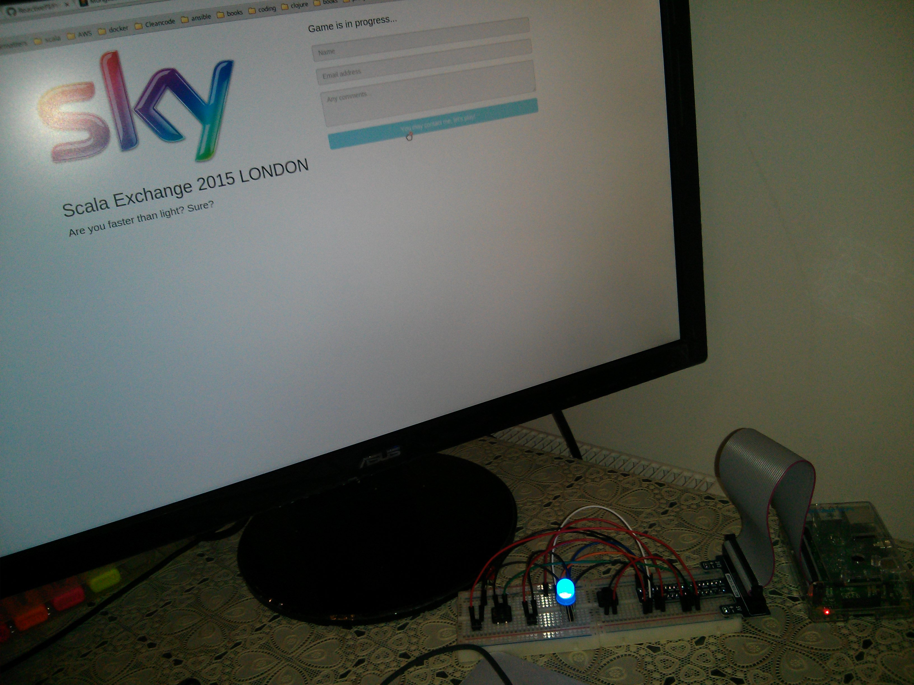

## Raspberry Pi reaction test for London Scala exchange 2015 

### Functionality
The application itself is a simple reaction measure system. 
- Start the test with the start button
- Provide your details on the web UI, submit the form
- After the submission it will randomly blink red, green or blue led. You have to push red, green or blue buttons respectively within the configured time range. 
- The progress indicator PWM red led starts from OFF state. Based on your reaction its pulse width will be increased till the point where it reaches its maximum. 
- When the red led reaches its maximum pulse width (brightest) the test is over. Calculated average reaction and number of tries will be recorded and displayed.
- Better reaction time results longer test period -> more tries -> higher score

That is it!
  
### Tool set
- [RaspberryPi](https://www.raspberrypi.org/products/raspberry-pi-2-model-b/) is the meat of the application
- [Fritzing](http://fritzing.org/home/) for circuit design
- [wiringPi](http://wiringpi.com/) for low level GPIO manipulation
- [pi4j](http://pi4j.com/) java library to interact with the pi
- [pi4j-client](http://github.com/lachata/pi4j-client) to be able to run pi4j code remotely on a desktop
- [Akka](http://doc.akka.io/docs/akka/2.4.0/scala.html?_ga=1.247924037.378696074.1444496540) to have actor, persistence, FSM, cluster support
- [AngularJS](https://angularjs.org/) to increase the UI development speed, support push messages
- [Bootstrap](http://getbootstrap.com/) to speed up ergonomical UI development

### Circuit layout
Items:
- 4 x 330Ohm resistances
- 1 x red led as a progress indicator
- 1 x RGB led
- 4 x buttons
- Breadboard + wires

GPIO usage
- Start/Stop button -> BCM_25 (input, PinPullResistance.PULL_UP)
- Shutdown button -> BCM_24 (input, PinPullResistance.PULL_UP)
- Red led (RGB bulb) -> BCM_19 (output)
- Green led (RGB bulb) -> BCM_13 (output)
- Blue led (RGB bulb) -> BCM_20 (output)
- Red button -> BCM_21 (input, PinPullResistance.PULL_UP)
- Green button -> BCM_23 (input, PinPullResistance.PULL_UP)
- Blue button -> BCM_24 (input, PinPullResistance.PULL_UP) (during the game it is a reaction button, after the game it is a shutdown button)
- Progress indicator -> BCM_12 (PWM output)

### Implementation details

